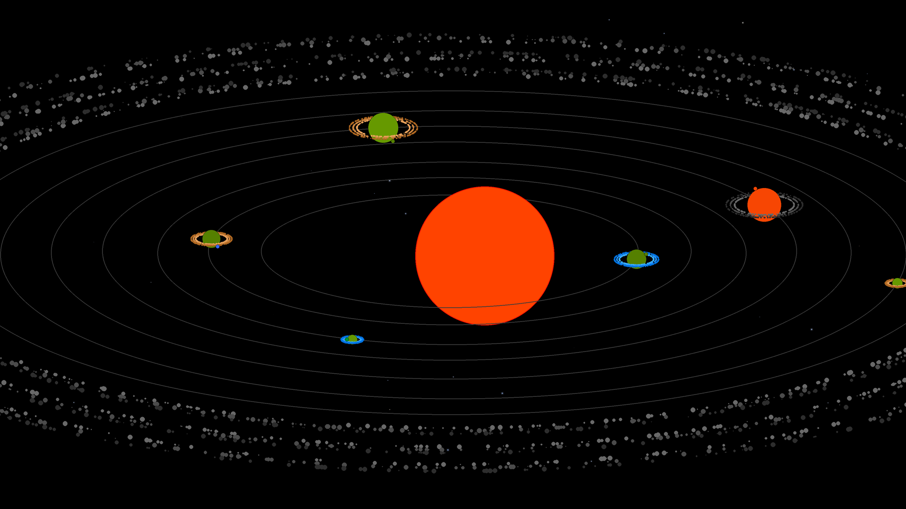

# ConstalationDreamer

Tento projekt umožòuje vytvoøit rùzné hvìzdné soustavy na základì zadaného textového øetìzce. Ten je rozdìlen do jednotlivých èástí a z nich jsou pak pøeèetny rùzné informace o dané soustavì. Tyto informace budou pozdìji objasnìny (pozdìji je myšleno èasovì ne teï v textu).

Kromì generování samotných soustav se pro jednoduchost vytvoøí i zjednodušený pohled na planety, které v daném systému jsou. Ty mohou být v nìkolika základních formách. Opìt je vše èteno z pùvodního zadaného øetìzce.

Následuje nìkolik ukázek samotných soustav a následnì dosavadní stav tvorby biomù.

[ ] - Refaktorovat vykreslovani objektu, pokusit se vymyslet takový pøístup, aby nebylo nutne rozlišovat jednolive instance a pouze se volalo draw, zde bude nejvìtší problém s pásem asteroidù.
[ ] - Refaktorovat zpùsob vykreslovani planet. Cílem bude, pøedat pøedem pøipravenou kreslici plochu, do ktere se vykreslí vzhled planety a po potøebnych upravach se vloží na specifikovane misto
[ ] - Sjednotit pøedávané objekty do draw, aby to vše bylo buï kreslici plocha (ImageDraw) nebo jen Image