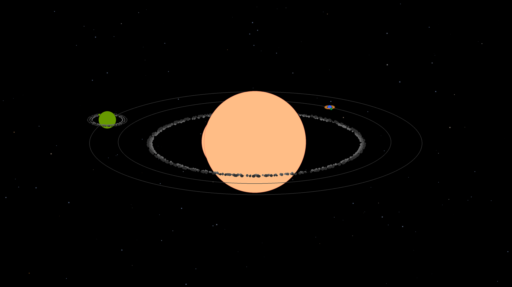
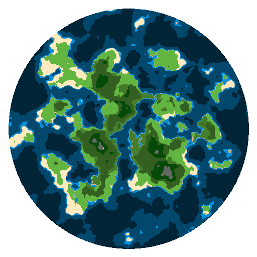

# ConstalationDreamer

Tento projekt umožòuje vytvoøit rùzné hvìzdné soustavy na základì zadaného textového øetìzce. Ten je rozdìlen do jednotlivých èástí a z nich jsou pak pøeèetny rùzné informace o dané soustavì. Tyto informace budou pozdìji objasnìny (pozdìji je myšleno èasovì ne teï v textu).

Kromì generování samotných soustav se pro jednoduchost vytvoøí i zjednodušený pohled na planety, které v daném systému jsou. Ty mohou být v nìkolika základních formách. Opìt je vše èteno z pùvodního zadaného øetìzce.

Následuje nìkolik ukázek samotných soustav a následnì dosavadní stav tvorby biomù.

<\p>

<\p>
